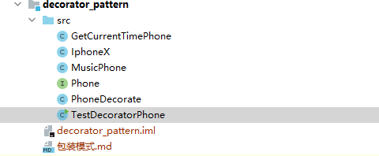

# 设计模式
设计模式的学习：包装模式、策略模式、责任链模式等


# 包装模式（修饰器模式） 

​		

### 对象增强的方式

* 继承
  * 继承父类，子类扩展
* 装饰器模式
  * 使用“包装”的方式来增强对象
* 代理模式
  * [代理模式](https://mp.weixin.qq.com/s?__biz=MzI4Njg5MDA5NA==&mid=2247484222&idx=1&sn=5191aca33f7b331adaef11c5e07df468&chksm=ebd7423fdca0cb29cdc59b4c79afcda9a44b9206806d2212a1b807c9f5879674934c37c250a1&scene=21#wechat_redirect)
  * 或者看我代理模式的笔记。

### 继承

​	最简单的方式就是继承父类，子类扩展来达到目的。虽然简单，但是这种方式的**缺陷非常大**：

*  如果**父类是带有数据、信息、属性的话，那么子类无法增强。** 
*  子类实现了之后**需求无法变更**，增强的内容是**固定**的。 

举例：

```shell
当时想要自己写一个简易的JDBC连接池，连接池由List<Connection>来管理。显然我们的对象是Connection，当写到close()方法的时候卡住了。

因为我们想要的功能是：调用close()是让我们的Connection返回到“连接池”(集合)中，而不是关闭掉。

此时我们不能使用继承父类的方式来实现增强。因为Connection对象是由数据库厂商来实现的，在得到Connection对象的时候绑定了各种信息(数据库的username、password、具体的数据库是啥等等)。我们子类继承Connection是无法得到对应的数据的！就更别说调用close()方法了。
```

所以，我们可以看到子类继承父类这种方式来扩展是**十分局限的，不灵活的**~因此我们就有了**装饰模式**！

### 继承方式实现

* 先写一个基本功能接口

  ```java
  public interface Phone {
      // 可以打电话
      void call();
  }
  ```

* 写一个类去实现基本功能接口

  ```java
  public class IphoneX implements Phone {    
      @Override    public void call() {        
          System.out.println("打电话给周围的人关注公众号Java3y");    
      }
  }
  ```

* 写一个类继承基本功能然后进行增强

  ```java
  public class MusicPhone extends Phone {
      // 听彩铃
      public void listenMusic() {
          System.out.println("我怀念的是无话不说,我怀念的是一起做梦~~~~~~");
      }
      @Override
      public void call() {
          // 在打电话之前听彩铃
          listenMusic();
          super.call();
      }
  }
  ```

* 后续一样，想要再增强，再继承一个类

```java
// 这里继承的是MusicPhone类
public class GiveCurrentTimePhone extends MusicPhone {
    // 给出当前的时间
    public void currentTime() {
        System.out.println("当前的时间是：" + System.currentTimeMillis());
    }
    @Override
    public void call() {
        super.call();
        // 打完电话提示现在的时间是多少啦
        currentTime();
    }
}
```

特点很明显需要去实现什么就继承什么类，缺点也很明显：

* 我不想听彩铃了，但是我还想要看时间，做不到~
* 我想要听彩铃前看下时间，做不到~
* 需求变动很大，但是我要实现的功能很小不需要其他功能的时候，仍旧要继承一堆的类

### 包装/装饰器模式实现

* 先写一个接口代表类的基本功能，比如打电话。

  ```java
  public interface Phone {
      void call();
  }
  ```

* 然后写一个类继承他

```java
public class IphoneX implements Phone{
    @Override
    public void call(){
        System.out.println("给漂亮的女孩子打了个电话，但是未接通...");
    }
}
```

* 写一层修饰类，然后修饰类记得要拿到传递的类然后递交给上一层：

```java
public class PhoneDecorate implements Phone{
    private Phone phone;
//    这边是对方法进行了重写
    public  PhoneDecorate(Phone phone) {
        this.phone=phone;
    }
//    调用phone的call方法
    @Override
    public void call() {
        phone.call();
    }
}
```

* 写功能增强，这里是彩铃~

```java
public class MusicPhone extends PhoneDecorate{    public void music(){        System.out.println("啊嘶嘚啊嘶嘚~选自《忐忑》");    }    public MusicPhone(Phone phone){        super(phone);    }    @Override    public void call(){        music();        super.call();    }}
```

* 写功能增强，这里是获取当前时间~

```java
public class GetCurrentTimePhone extends PhoneDecorate{    public GetCurrentTimePhone(Phone phone) {        super(phone);    }    public void getCurrentTime(){        SimpleDateFormat df = new SimpleDateFormat("yyyy-MM-dd HH:mm:ss");//设置日期格式        System.out.println(df.format(new Date()));// new Date()为获取当前系统时间    }    @Override    public void call(){        super.call();        getCurrentTime();    }}
```

* 写测试类去测试流程

  ```java
  public class TestDecoratorPhone {    public static void main(String[] args) {        Phone  iphoneX = new IphoneX();        iphoneX=new MusicPhone(iphoneX);        iphoneX=new GetCurrentTimePhone(iphoneX);        iphoneX.call();    }}
  ```

总体脉络和文件：



### 装饰模式的优缺点：

#### 优点

* 装饰类和被装饰类是可以**独立**的，低耦合的。互相都不用知道对方的存在

* 装饰模式是继承的一种**替代**方案，**无论包装多少层，返回的对象都是is-a的关系**(上面的例子：包装完还是Phone类型)。
* 实现动态扩展，只要**继承了装饰器**就可以**动态**扩展想要的功能了。

#### 缺点

- 多层装饰是比较复杂的，提高了系统的复杂度。不利于我们调试~


# 代理模式

  代理模式说白了就是你要做什么，就请个人帮你做。

* 比如你买不到K40，就花贰佰请黄牛帮忙买（麻了，我就亏了贰佰）。
* 你写了点不正经的代码，例如爬了些奇怪的网站，被抓了，请律师帮忙打官司。
* 你有一堆脑残粉，你想赚他的钱，你总不能跟他们要吧，请经纪人/代理人卖周边。


### 代理模式很容易和修饰器模式弄混，我这里提一嘴：

#### 相同点：

* 二者都能对功能进行增强
* 在静态代理模式下需要传递对象，这里和修饰器模式很类似，但值得注意的一点是装饰器模式的对象从没变过，而静态模式变过。

#### 不同点

* 装饰器模式是在功能外增强，并不会影响你这个类，原本是什么类最后也还是什么类。代理模式使用后，类会改变，不是原本的类了，而是代理的类。
* 装饰器模式仅仅提供功能增强不会增强的类有所牵制。代理模式会对类施加控制， 并不提供对象本身的增强功能，而是使用代理后的对象进行的增强。

需要看装饰器模式的可以看我的这个文章：[装饰器模式](https://blog.csdn.net/qq_42388853/article/details/117741649)

### 静态代理模式

  静态代理模式就是把本体类传进代理类里，让代理类帮我们做增强行为。

* 写一个接口，代表我的职业

```java
public interface Programmer {
//    身为一个程序猿必须会写代码
    void coding();
}

```

* 我叫zsp是一个程序猿

  ```java
  package static_proxy;
  public class ZSP implements Programmer{
      //    我叫zsp，一个程序猿
      @Override
      public void coding() {
          System.out.println("我叫zsp，一个程序猿,每天都喜欢学新的东西")
      }
  }
  ```

* 我很喜欢写代码，但是没什么人看，我需要我崇拜的人Java3y来给我点赞博取关注

  ```java
  public class Java3y implements Programmer{
  //    Java3y是我很崇拜的一个程序猿，
  //    得到他的点赞会让我很开心
  //    也能让更多人认识我
      private ZSP zsp;
      public Java3y(ZSP zsp){
          this.zsp=zsp;
      }
      public void like(){
          System.out.println("Java3y给我点了一个赞");
      }
      @Override
      public void coding() {
          zsp.coding();
          like();
      }
  }
  ```

  

* 最后，把类装进代理类里，进行代理实现

```java
public class TestStaticProxy {
    public static void main(String[] args) {
        ZSP zsp = new ZSP();
        Programmer java3y = new Java3y(zsp);
        java3y.coding();
    }
}

```


### 透明代理模式

  透明代理和静态代理的不同就是不需要传递对象给构造方法了，直接在代理类中生成需要方法增强的对象。

  举例：3Y看我写的非常好（自吹的），但是就没人看，于是以后每天都帮我点赞，不帮别人点赞了

* 在静态代理的基础上，对代理类进行修改：

```java
public class Java3y implements Programmer{
    private ZSP zsp;
//透明代理就是：3Y看我写的非常好（自吹的），
// 但是就没人看，于是以后每天都帮我点赞，不帮别人点赞了
    public Java3y() {
        this.zsp = new ZSP();
    }
    public void like(){
        System.out.println("Java3y以后只为我点赞，不帮别人点赞了~");
    }
    @Override
    public void coding() {
        zsp.coding();
        like();
    }
}
```

* 进行实现：

```java
public class TestStaticProxy {
    public static void main(String[] args) {
        Programmer java3y = new Java3y();
        java3y.coding();
    }
}
```

### 代理模式自定义方法

  就是透明模式的功能增强，加了点功能。

  举例：自定义代理就是3Y一直给我点赞，导致看我的人越来越多（并没有），然后3Y就想要向我收费了（也没有）；

* 改变的代码只有这里，所以就只贴这个。

```java
package custom_proxy;

public class Java3y implements Programmer {
    private ZSP zsp;
//自定义代理就是3Y一直给我点赞，导致看我的人越来越多（并没有）
//    然后3Y就想要向我收费了（也没有）
    public Java3y() {
        this.zsp = new ZSP();
    }
    public void like(){
        System.out.println("Java3y以后只为我点赞，不帮别人点赞了~");
    }
    public void getMoney(){
        System.out.println("现在点赞要贰佰~");
    }
    @Override
    public void coding() {
        zsp.coding();
        like();
        getMoney();
    }
}

```

### 动态代理

   动态代理运用的是java自带的一个API，即Proxy。

  举例：因为3Y要钱（并没有），所以我交不起钱了，只能请水军。

```JAVA
public class Dynamic_Proxy {
    public static void main(String[] args) {
        ZSP zsp = new ZSP();
        Programmer  programmerWaterArmy  = (Programmer) Proxy.newProxyInstance(zsp.getClass().getClassLoader(), zsp.getClass().getInterfaces(), ((proxy, method, args1) -> {
            if (method.getName().equals("coding")) {
                method.invoke(zsp, args);
                System.out.println("水军，来水评论了");
            } else {
                return method.invoke(zsp, args);
            }
            return null;
        }));
        programmerWaterArmy.coding();
    }
}
```

这个方法需要传入的三个参数分别是：

* 生成代理对象使用的类加载器。
* 生成对象的额接口。
* 生成代理对象方法里要怎么做。

### 动态代理和静态代理的区别：

* 静态代理需要我们传入代理对象。而动态代理不用，他是自己生成的。
* 使用静态代理时：如果目标对象的接口有**很多方法**的话，那我们还是得一一实现，这样就会比较麻烦。
* 使用动态代理时：代理对象的生成，是利用JDKAPI，**动态地在内存中构建代理对象**(需要我们指定创建 代理对象/目标对象 实现的接口的类型)，并且会默认实现接口的所有方法。

### 代理模式很容易和修饰器模式弄混，我这里提一嘴：

#### 相同点：

* 二者都能对功能进行增强
* 在静态代理模式下需要传递对象，这里和修饰器模式很类似，但值得注意的一点是装饰器模式的对象从没变过，而静态模式变过。

#### 不同点

* 装饰器模式是在功能外增强，并不会影响你这个类，原本是什么类最后也还是什么类。代理模式使用后，类会改变，不是原本的类了，而是代理的类。
* 装饰器模式仅仅提供功能增强不会增强的类有所牵制。代理模式会对类施加控制， 并不提供对象本身的增强功能，而是使用代理后的对象进行的增强。

需要看装饰器模式的可以看我的这个文章：[装饰器模式](https://blog.csdn.net/qq_42388853/article/details/117741649)


### 策略模式

  这玩意很简单，举个例子，就是为了让你选择解决一件事的方法。比如我上学，我可以走着去，可以可以开飞机去，可以爬过去，这些都是去上学的方法。但写在一个方法里需要很多的if和else，维护起来非常的不方便，所以推出了策略模式。

  示例：向一个类里面传入不同的类，会根据传入类的不同执行不同的方法。

* 首先写一个接口用来放需要执行的不同的方法（出行方式）。

```java
public interface GoToSchool 
{   
    void action();
}
```

* 然后创造不同的方法（出行方式），以下都是不同的方法：

```java
public class ByFoot implements GoToSchool {
    @Override    
    public void action() {
        System.out.println("走路去上学，很累的，但是没得办法，没有钱！");    
                         }}
```

```java
public class ByPlane implements GoToSchool{    
    @Override    
    public void action() { 
        System.out.println("可能学校离得远，需要飞过去把~");   
    }}
```

```java
public class ByTaxi implements GoToSchool{    
    @Override    
    public void action() {
        System.out.println("什么家庭，居然搭计程车去上学，哦原来是我啊！");    
    }}
```

* 根据传入的类的不同，调用该类的action方法。

```java
public class ZSPGo {  
private GoToSchool toSchool;    
public ZSPGo(GoToSchool toSchool){       
    this.toSchool=toSchool;    
}    
public void exec(){ 
    toSchool.action();  
}}

```

* 创建主方法实现它。

```java
public class StuGoSchool {    public static void main(String[] args) {  
    ZSPGo zspGoByFoot=new ZSPGo(new ByFoot());       
    zspGoByFoot.exec();       
    System.out.println("===============");       
    ZSPGo zspGoByPlane=new ZSPGo(new ByFoot());        
    zspGoByPlane.exec();       
    System.out.println("===============");        
    ZSPGo zspGoByTaxi=new ZSPGo(new ByTaxi());        zspGoByTaxi.exec();    }}
```