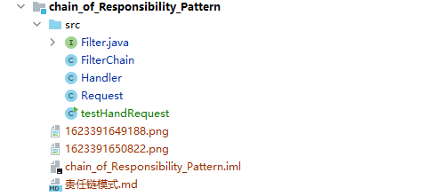

# 责任链模式

责任链模式： 为请求创建了一个接收者对象的链。这种模式给予请求的类型，对请求的发送者和接收者进行解耦。这种类型的设计模式属于行为型模式。 

上面的解释很晦涩，说白了就是看不太懂，下面我来说人话。

### 举例说明

  例子：我们的正常的请求像一堆杂物一样，比如里面有大米，有鸡蛋，有小孩的奶粉和一坨屎。那我们的客户想要做饭，那就必须先过滤掉鸡蛋和奶粉还有屎对吧。毕竟又不是什么老八...对不起，这里无意中伤。

  以最快的方式对上面的需求进行实现，我们可以用if语句：

* 模拟发送过来的请求

  ```java
  public class Request {
      // 请求的数据
      private String data;
      public String getData() {
          return data;
      }
      public void setData(String data) {
          this.data = data;
      }
  }
  ```

* 接下去用if来编写过滤

```java
public class Handler {
    public void handlerRequest(Request request) {
        // 得到请求的数据
        String data = request.getData();

        if (data.contains("鸡蛋")) {
            filterEgg(data);
        }
        if (data.contains("小孩奶粉")) {
            filterDrunk(data);
        }
        if (data.contains("屎")) {
            filterShit(data);
        }       
    }
    private void filterShit(String data) {
        //doSomething
    }
    private void filterDrunk(String data) {
        //doSomething
    }
    private void filterEgg(String data) {
        //doSomething
    }
}
```

  好了需求用if编写完了，然后某一天请求多了地瓜，面条，薯片，

然后我们就要去里面在多上多个if，时间长了写的代码一坨一坨的不好维护不说，

代码也跟狗屎一样，这显然不符合我们面向对象和解耦的需求。

#### 我们应该将每个处理方式抽取出来成一个类，每个类各司其职。

#### 无论是过滤狗屎还是过滤鸡蛋还是过滤七七八八的，做的事都是**过滤**。

#### 我们就可以将其抽象成**接口**。于是我们就有**一个接口，多个实现类**。 


### 实现责任链

* 先写一个过滤器的功能接口，用来让所有过滤器继承基本功能，然后实现需要的过滤器。

```java
public interface Filter {
    void doFilter(String data);
}
class FilterEgg implements Filter{
    @Override
    public void doFilter(String data) {
        List<String> strings = Arrays.asList(data.split(","));
        boolean egg = strings.contains("egg");
        if (egg){ System.out.println("过滤了鸡蛋~");}
    }
}
class FilterDrunk implements Filter{
    @Override
    public void doFilter(String data) {
        List<String> strings = Arrays.asList(data.split(","));
        boolean drunk = strings.contains("drunk");
        if (drunk) {System.out.println("过滤了奶粉~");}
    }
}
class FilterShit implements Filter{
    @Override
    public void doFilter(String data) {
        List<String> strings = Arrays.asList(data.split(","));
        boolean shit = strings.contains("shit");
        if (shit){ System.out.println("过滤了屎~"); }
    }
}
```


* 编写一个过滤链用来放所有的过滤器

```java
public class FilterChain {
    List<Filter> filters = new ArrayList<>();
    public FilterChain() {
        filters.add(new FilterEgg());
        filters.add(new FilterShit());
        filters.add(new FilterDrunk());
    }
    public void processData(String data){
        for (Filter filter : filters) {
            filter.doFilter(data);
        }
    }
}

```

* 把请求放进过滤器链里面

```java
public class Handler {
    public void HandlerRequest(Request request){
        String data = request.getData();
        FilterChain filterChain = new FilterChain();
        filterChain.processData(data);
    }
}
```

* 模拟一个请求递交给过滤链

```java
public class Request {
    private String  data;
    public String getData() {
        return data;
    }
    public void setData(String data) {
        this.data = data;
    }
    public Request(String data) {
        this.data = data;
    }
}
```

* 最后先写类进行测试

```java
public class testHandRequest {
    public static void main(String[] args) {
        Request request = new Request("egg,chicken,mi,drunk,shit");
        Handler handler = new Handler();
        handler.HandlerRequest(request);
    }
}
```

文件目录结构如下：



### 下面来讲下为什么要用责任链模式

  来回顾一下我做了什么：

* 将各个过滤流程的if抽象成了一个类。
* 使用过滤链将过滤器串了起来。

##### 说到底，我干了什么？我就把过滤使用的if抽取出来用类实现罢了

### 为什么要这样做？

* 因为这样可以使得过滤流程更加**分工明确，解耦，容易维护**。 
* 增加一个具体的`Handler`处理类，不会影响到`BaseHandler`的代码。

### 缺点：

* 增加一个具体的`Handler`处理类，不会影响到`BaseHandler`的代码。

* 不好调试，初看代码时不好阅读。（对外只是一个`doChain`方法，

  而里边由多个处理类来组成，还得看相应的调用顺序）。